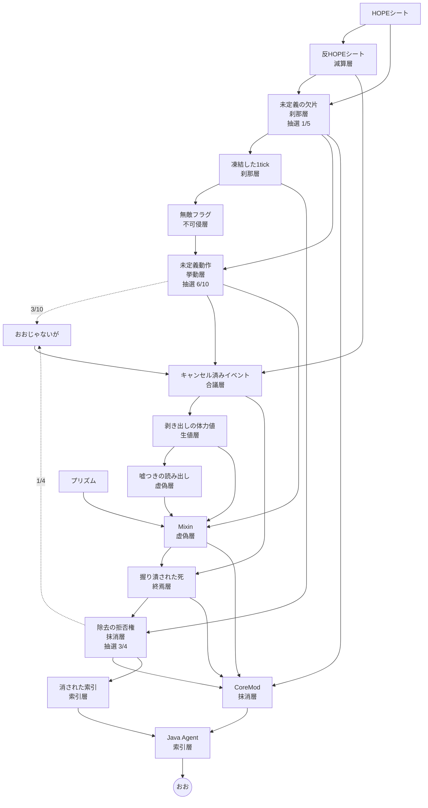

# おおの作り方

「おお」は作業台では作れない。**対消滅炉の儀式**でしか手に入らない。

儀式に必要な 10 個の素材は、それぞれ[貫通層](../README.md)を 1 つずつ受け持っている。
表層から索引層へ向かって 1 段ずつ降りる形で並んでいて、下へ行くほど人間の言葉を失い、
完成品の「おお」だけが感嘆に戻る。

> このファイルは `ModItems` のコメント・`BEAnnihilationChamber.RITUAL` ・
> `src/main/resources/data/tpsthings/recipes/` から起こしたもの。
> レシピを変えたらここも直すこと。

---

## 1. 儀式

対消滅炉 (`tpsthings:annihilation_chamber`) の**上面に 1 つずつ投げ込む**。

1. 始まりの**反HOPEシート**は、他に何も乗っていない上面に 1 枚だけ置く
2. あとは下の順に 1 つずつ。1 段進むごとに周りが暗く静かになる
3. **先の層の素材を混ぜると失敗**し、「おおじゃないが」が残る
4. **1 分間なにも投げ込まないと途切れる**
5. Java Agent を入れると索引層のフラッシュ → 完全な無音 → 白 → おおが浮かぶ

| # | 層 | 投げ込むもの |
|---|---|---|
| 1 | 減算層 | 反HOPEシート |
| 2 | 刹那層 | 未定義の欠片 |
| 3 | 不可侵層 | 無敵フラグ |
| 4 | 挙動層 | 未定義動作 |
| 5 | 合議層 | キャンセル済みイベント |
| 6 | 生値層 | 剥き出しの体力値 |
| 7 | 虚偽層 | Mixin |
| 8 | 終焉層 | 握り潰された死 |
| 9 | 抹消層 | 除去の拒否権 |
| 10 | 索引層 | Java Agent |

対消滅炉そのものは作業台で作る。

| | | |
|---|---|---|
| 黒曜石 | HOPEシート | 黒曜石 |
| HOPEシート | タイムフラックスの結晶 | HOPEシート |
| 黒曜石 | HOPEシート | 黒曜石 |

---

## 2. 系譜

---

## 3. 層の素材ひとつずつ

### 減算層 — 反HOPEシート

**加圧反応室**

| 入力 | 量 |
|---|---|
| HOPEシート | 1 |
| NOPE (液) | 1000 mB |
| 気化NOPE | 1000 mB |
| エネルギー | 10,000 J |
| 時間 | 400 tick |

出力: 反HOPEシート ×1

> 希望を裏返すと / 絶望ではなく / 何も起きないが残る

---

### 刹那層 — 未定義の欠片

**対消滅炉** (抽選)

| 入力 | 量 |
|---|---|
| HOPEシート | 1 |
| 反HOPEシート | 1 |

| 結果 | 重み | 確率 |
|---|---|---|
| 未定義の欠片 ×1 | 1 | **20%** |
| 何も出ない | 4 | 80% |

欠片は**名前もモデルも持たない**。生の翻訳キーが出るのが正しい姿。

---

### 刹那層 — 凍結した1tick

**化学注入室**

| 入力 | 量 |
|---|---|
| 未定義の欠片 | 1 |
| タイムフラックス | 10 mB |

出力: 凍結した1tick ×1

> 殴られてから十の刻み / 世界が待ってくれる / わずかな猶予

---

### 不可侵層 — 無敵フラグ

**浄化室**

| 入力 | 量 |
|---|---|
| 凍結した1tick | 1 |
| HOPE酸素 | 5 mB |

出力: 無敵フラグ ×1

> 真偽値ひとつで / 刃は届かなくなる / 薄い 薄い旗

---

### 挙動層 — 未定義動作

**対消滅炉** (抽選)

| 入力 | 量 |
|---|---|
| 未定義の欠片 | 2 |
| 無敵フラグ | 2 |
| タイムフラックスの結晶 | 1 |

| 結果 | 重み | 確率 |
|---|---|---|
| 未定義動作 ×1 | 6 | **60%** |
| おおじゃないが ×1 | 3 | 30% |
| 何も出ない | 1 | 10% |

**「おおじゃないが」の主な入手先はここ。** 失敗景品だが、次の合議層で 4 個必要になる。

> 仕様書の余白には / 何を書いてもいい / 鼻から悪魔が出ても

---

### 合議層 — キャンセル済みイベント

**作業台**

| | | |
|---|---|---|
| おおじゃないが | 反HOPEシート | おおじゃないが |
| 反HOPEシート | 未定義動作 | 反HOPEシート |
| おおじゃないが | 反HOPEシート | おおじゃないが |

出力: キャンセル済みイベント ×1 (おおじゃないが ×4、反HOPEシート ×4、未定義動作 ×1)

> 呼ばれた声は / 誰にも届かなかった / キャンセル済み

---

### 生値層 — 剥き出しの体力値

**加圧反応室**

| 入力 | 量 |
|---|---|
| キャンセル済みイベント | 1 |
| NOPE (液) | 500 mB |
| HOPE水素 | 500 mB |
| エネルギー | 5,000 J |
| 時間 | 200 tick |

出力: 剥き出しの体力値 ×1 + 二酸化炭素 100 mB

> 包み紙を剥がした / 体力という数字は / 思ったより脆い

---

### 虚偽層 — 嘘つきの読み出し

**オスミウム圧縮機**

| 入力 | 量 |
|---|---|
| 剥き出しの体力値 | 1 |
| 気化NOPE | 5 mB |

出力: 嘘つきの読み出し ×1

> 尋ねるたびに / 満タンだと答える / 優しい嘘

---

### 虚偽層 — Mixin

**作業台** (定形なし)

- 剥き出しの体力値 ×1
- 嘘つきの読み出し ×1
- 未定義動作 ×1
- プリズム ×1

出力: Mixin ×1

> 他人の体に / そっと言葉を差し込む / 頭の一行だけで

---

### 終焉層 — 握り潰された死

**結合機**

| 入力 | 量 |
|---|---|
| Mixin (主) | 1 |
| キャンセル済みイベント (副) | 2 |

出力: 握り潰された死 ×1

> 終わりの手続きを / 途中で握り潰す / 死はまだ来ない

---

### 抹消層 — 除去の拒否権

**対消滅炉** (抽選)

| 入力 | 量 |
|---|---|
| 握り潰された死 | 1 |
| 凍結した1tick | 4 |

| 結果 | 重み | 確率 |
|---|---|---|
| 除去の拒否権 ×1 | 3 | **75%** |
| おおじゃないが ×1 | 1 | 25% |

> 消えろと言われて / 首を横に振った / それだけのこと

---

### 抹消層 — CoreMod

**作業台**

| | | |
|---|---|---|
| 未定義の欠片 | Mixin | 未定義の欠片 |
| 握り潰された死 | QOLest | 除去の拒否権 |
| 未定義の欠片 | Mixin | 未定義の欠片 |

出力: CoreMod ×1 (欠片 ×4、Mixin ×2、握り潰された死 ×1、除去の拒否権 ×1、QOLest ×1)

> クラスが生まれる前に / 名前を書き換える / 誰にも気づかれずに

---

### 索引層 — 消された索引

**精密製材機**

| 入力 | 量 |
|---|---|
| 除去の拒否権 | 1 |

出力: 消された索引 ×1 + 未定義の欠片 ×1 (25%)

> 世界の名簿から / 名前が消えても / まだ息をしている

---

### 索引層 — Java Agent

**作業台**

| | | |
|---|---|---|
| タイムフラックスの結晶 | 消された索引 | タイムフラックスの結晶 |
| 消された索引 | CoreMod | 消された索引 |
| タイムフラックスの結晶 | 消された索引 | タイムフラックスの結晶 |

出力: Java Agent ×1 (結晶 ×4、消された索引 ×4、CoreMod ×1)

> 読み込まれるより先に / そこにいた / 最初から ずっと

---

## 4. 下地の素材

### HOPE ライン (Mekanism の HDPE ラインと同じ形)

| 作るもの | 機械 | 入力 | 出力 |
|---|---|---|---|
| 二酸化炭素 | 化学酸化機 | 石炭 ×1 | 二酸化炭素 1000 mB |
| 気化NOPE | 加圧反応室 | スパイス ×1 + 水 100 mB + 二酸化炭素 1000 mB | 気化NOPE 100 mB |
| NOPE (液) | 回転式流体凝縮器 | 気化NOPE 1 mB | NOPE 1 mB (両方向) |
| HOPE水素 / HOPE酸素 | 電解分離機 | NOPE 2 mB | 水素 2 mB + 酸素 1 mB |
| HOPEバイオ燃料 | 化学結晶化装置 | 気化NOPE 100 mB | ×1 |
| HOPE基質 | 加圧反応室 | バイオ燃料 ×1 + NOPE 100 mB + HOPE水素 100 mB | 基質 ×1 + HOPEエチレン 100 mB |
| HOPEペレット | 加圧反応室 | 基質 ×1 + 液化HOPEエチレン 100 mB + HOPE酸素 100 mB | ペレット ×1 |
| **HOPEシート** | 濃縮室 | ペレット ×3 | シート ×1 |

スパイスは作業台 (定形なし): ブレイズパウダー / ネザーウォート / 砂糖 / ヒカリゴケの実 /
スイートベリー / ハチミツ入りの瓶 / ニンジン / カカオ豆 / コーラスフルーツ。

### タイムフラックス

| 作るもの | 機械 | 入力 | 出力 |
|---|---|---|---|
| タイムフラックス | **タイムフラックス収集機** | (電力のみ・19 tick ごと) | 10 mB |
| タイムフラックスの結晶 | 化学結晶化装置 | タイムフラックス 200 mB | ×1 |

### プリズム (Mixin に要る)

**作業台**

| | | |
|---|---|---|
| ガラス | アメジストの欠片 | ガラス |
| アメジストの欠片 | タイムフラックスの結晶 | アメジストの欠片 |
| ガラス | アメジストの欠片 | ガラス |

### QOL ライン (CoreMod に要る)

| 作るもの | 形 | 材料 |
|---|---|---|
| QOL | 定形なし | 丸石 ×4 + 棒 ×1 |
| QOLer | 十字 | 銅インゴット ×4 + QOL ×1 |
| QOLest | 十字 | ダイヤ ×4 + QOLer ×1 |

---

## 5. おお 1 個あたりの期待コスト

抽選を期待値で線形化した数字。**分散は考えていない**ので、実際はこれより上振れも下振れもする。

### 中間素材

| 素材 | 個数 |
|---|---:|
| HOPEシート | **25,896** |
| 反HOPEシート | 13,045 |
| 未定義の欠片 | 2,570 |
| 凍結した1tick | 1,300 |
| 無敵フラグ | 1,268 |
| タイムフラックスの結晶 | 650 |
| おおじゃないが | 192 |
| 未定義動作 | 62 |
| キャンセル済みイベント | 48 |
| 剥き出しの体力値 | 27 |
| Mixin / 嘘つきの読み出し / プリズム | 各 13 |
| 握り潰された死 | 10 |
| 除去の拒否権 | 6 |
| 消された索引 | 4 |
| CoreMod / Java Agent / QOLest | 各 1 |

### 対消滅炉を回す回数

| 反応 | 回数 |
|---|---:|
| 欠片 (1/5) | **12,852** |
| 未定義動作 (6/10) | 633 |
| 除去の拒否権 (3/4) | 8 |

### 資源

| 資源 | 量 |
|---|---:|
| HOPEペレット | 77,689 |
| NOPE (液) | 約 13,058,000 mB |
| 気化NOPE | 約 13,045,000 mB |
| タイムフラックス | 約 143,000 mB |
| HOPE水素 | 13,500 mB |
| HOPE酸素 | 6,338 mB |
| アメジストの欠片 | 52 |
| ダイヤ | 4 |

---

## 6. 現状で詰んでいるところ

### タイムフラックスが自分自身を要求する

タイムフラックスを作れるのは**タイムフラックス収集機だけ**。
そしてタイムフラックス収集機のレシピは:

| | | |
|---|---|---|
| ガラス板 | **タイムフラックスの結晶** | ガラス板 |
| 鉄インゴット | 鋼鉄ケーシング | 鉄インゴット |
| 鉄インゴット | 鉄インゴット | 鉄インゴット |

結晶はタイムフラックス 200 mB から作る。**最初の 1 個を作る手段がない。**
収集機はクリエイティブタブにも並んでいないので、サバイバルでは
`/give` を使わない限りタイムフラックス系統ごと到達不能。

→ 収集機を別素材で作れるようにするか、タイムフラックスの初期入手を別に用意する必要がある。

### おおじゃないがが全体のコストを決めてしまっている

「おおじゃないが」は**対消滅炉の失敗景品でしか出ない** (未定義動作の炉から 30%、
除去の拒否権の炉から 25%)。一方でキャンセル済みイベントが 1 個につき 4 個要求し、
そのキャンセル済みイベントが 48 個要る。

結果、儀式に必要な未定義動作は 1 個なのに、**おおじゃないがを 192 個集めるために
未定義動作の炉を 633 回回すことになり、未定義動作が 380 個も余る**。
上の 25,896 枚という HOPEシートの数字は、ほぼ全部がここから来ている。

→ おおじゃないがに確定の入手経路を与えるか、キャンセル済みイベントの要求数を
減らすのが効く。

---

## 関連

- 貫通層そのものの説明は [README](../README.md)
- 反応と儀式の定義は `BEAnnihilationChamber.REACTIONS` / `.RITUAL`
- 層の対応は `ModItems` の `ItemLayer(層番号, ...)`
- JEI ではおおのアイテム説明ページに儀式の手順が出る
